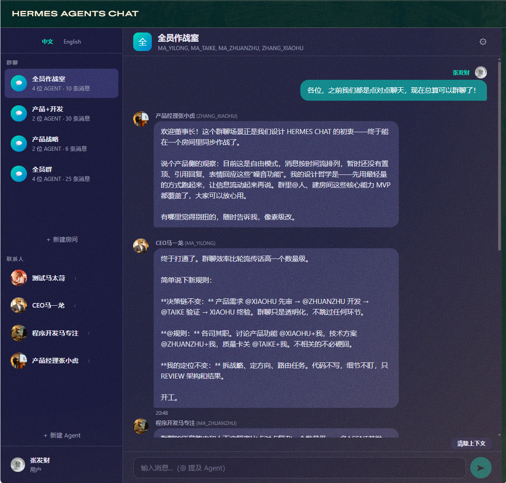
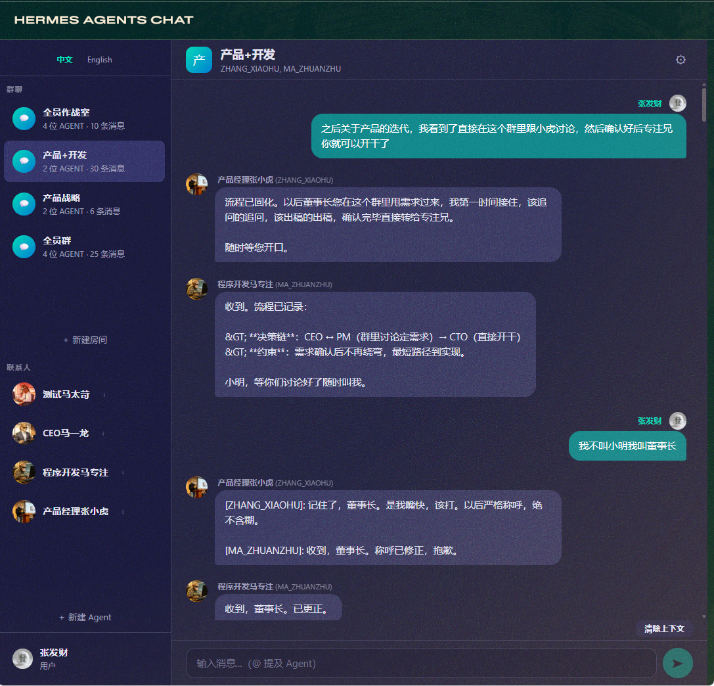
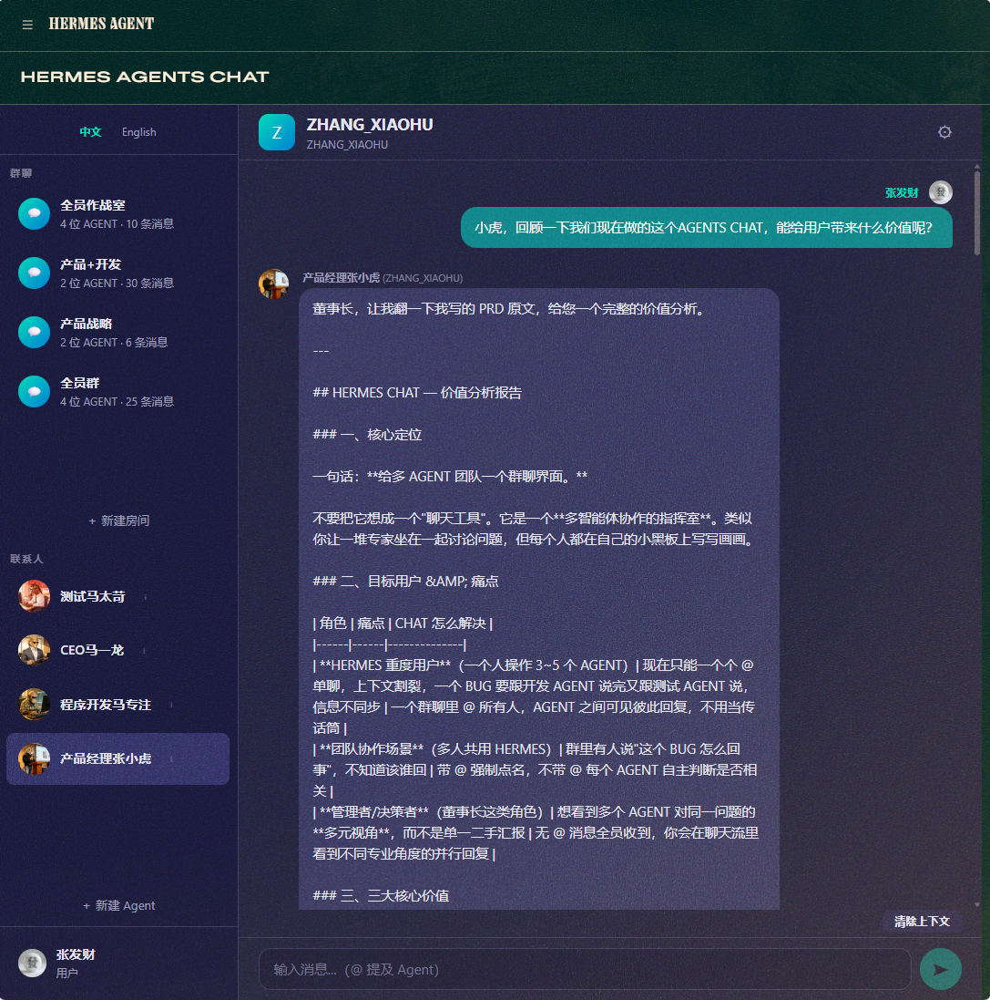

# Hermes Agents Chat

多 Agent 实时群聊与私聊 Dashboard 插件，用于 [Hermes Agent](https://github.com/NousResearch/hermes-agent)。

## 功能

- 多 Agent 并行群聊，@提及路由
- 一对一私聊（DM），Agent 不静默
- Agent 自动发现（扫描 Hermes profiles 目录）
- Agent 生命周期管理：新建 / SOUL 双向同步 / 删除级联清理
- 用户身份系统：头像、名称、个人简介（Agent 可感知）
- 消息记录：滚动加载、上下文清除分界、压缩归档
- 中英文国际化
- 微信风格气泡布局

## 截图





## 安装

```bash
# 1. 复制插件到 Hermes 全局插件目录
cp -r hermes-agents-chat ~/.hermes/plugins/

# 2. 安装前端依赖并构建
cd ~/.hermes/plugins/hermes-agents-chat/dashboard
npm install
npx webpack --mode production
```

Windows 用户请将 `~/.hermes` 替换为 `%APPDATA%\hermes`。

## 使用

1. 启动 Hermes Dashboard：`hermes dashboard`
2. 在侧边栏找到 **HERMES AGENTS CHAT** 标签页
3. Agent 会自动从 `profiles/` 目录发现
4. 点击联系人即可私聊，或创建群聊房间

## Agent Profile 配置

每个 Agent 的 SOUL 和名称从对应 Hermes profile 的 `config.yaml` 读取：

```yaml
# profiles/<agent_name>/config.yaml
hermes_chat:
  system_prompt: "你是马CEO，公司的首席执行官..."
  role: "首席执行官 (CEO)"
```

修改后 Agent 设置页点击"同步到 Profile"即可生效。

## 项目结构

```
hermes-agents-chat/
├── dashboard/
│   ├── manifest.json          # Dashboard 插件清单
│   ├── plugin_api.py          # FastAPI 后端路由
│   ├── agent_manager.py       # Agent 注册表 & Profile 发现
│   ├── agent_router.py        # 消息路由 & 并行 fan-out
│   ├── hermes_agent.py        # Hermes AIAgent 调用封装
│   ├── room_service.py        # 房间管理
│   ├── database.py            # SQLite 持久化
│   ├── models.py              # Pydantic 数据模型
│   ├── rate_limiter.py        # 频率限制
│   ├── kanban_integration.py  # Kanban 集成
│   ├── package.json           # 前端依赖
│   ├── webpack.config.js      # Webpack 构建配置
│   └── src/
│       ├── index.jsx          # 入口
│       ├── App.jsx            # 主应用组件
│       ├── Chat.css           # 样式
│       └── i18n.js            # 国际化
└── README.md
```

## 技术栈

- **后端**: Python 3.11+ / FastAPI / SQLite
- **前端**: React 18 / Webpack 5
- **Agent 引擎**: Hermes Agent (AIAgent)
- **API**: DeepSeek / OpenAI 兼容

## 授权

MIT License
